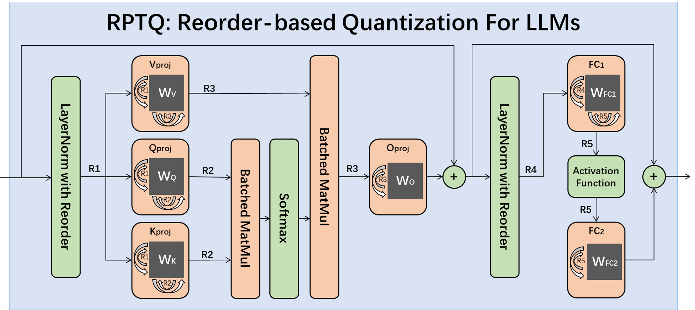

# RPTQ: Reorder-Based Post-Training Quantization for Large Language Models
Large-scale language models (LLMs) have shown exceptional performance on various tasks. However, the deployment of LLMs is challenging due to their enormous size. One of the main challenges in quantizing LLMs is the different ranges between the channels, which affects the accuracy and compression ratio of the quantized model.
In our [paper](https://arxiv.org/abs/2304.01089), we propose a novel reorder-based quantization approach called RPTQ. The RPTQ approach involves rearranging the channels in the activations and then quantizing them in clusters, thereby reducing the impact of the range difference between channels. 
By implementing the RPTQ approach, we achieved a significant breakthrough by pushing LLM models to 3 bit activation for the first time.



Update
- 2023.4.23 An bug in the calculation of the reorder index was identified in qkt_matmul (R2). This bug has been fixed, and the results have been updated accordingly.

### Requirements
python packages
- torch >= 2.0.0
- transformers>=4.28.0
- omegaconf pycountry sqlitedict lm-eval


### Usage
The RPTQ approach can be applied to OPT models.
```
python main.py opt-1.3b --wbits 4 --abits 4 --eval_ppl --tasks lambada_openai,piqa,arc_easy,arc_challenge,openbookqa,boolq
```

Only quantize K/V cache:
```
python main.py opt-1.3b --wbits 4 --abits 4 --only_quant_kv --eval_ppl --tasks lambada_openai,piqa,arc_easy,arc_challenge,openbookqa,boolq
```

To quantize larger network please use `--multigpu`:
```
python main.py opt-66b --wbits 4 --abits 4 --only_quant_kv --eval_ppl --tasks lambada_openai,piqa,arc_easy,arc_challenge,openbookqa,boolq --multigpu
```

### Results

Perplexity

|  Model | OPT-1.3b |        |        | OPT-6.7b |        |        | OPT-13b |        |        | OPT-30b |        |        | OPT-66b |        |        | OPT-175b |        |        |
|:------:|:--------:|:------:|:------:|:--------:|:------:|:------:|:-------:|:------:|:------:|:-------:|:------:|:------:|:-------:|:------:|:------:|:--------:|:------:|:------:|
|  Task  |   WIKI   |   PT   |   C4   |   WIKI   |   PT   |   C4   |   WIKI  |   PT   |   C4   |   WIKI  |   PT   |   C4   |   WIKI  |   PT   |   C4   |   WIKI   |   PT   |   C4   |
|  FP16  |  14.63   | 16.96  | 14.72  |  10.86   | 13.09  | 11.74  |  10.13  | 12.34  | 11.20  |  9.56   | 11.84  | 10.69  |  9.34   | 11.36  | 10.28  |   8.34   | 12.01  | 10.13  |
|  W4A16 |  14.78   | 17.21  | 14.92  |  11.18   | 13.62  | 12.07  |  10.29  | 12.45  | 11.27  |  9.55   | 11.91  | 10.74  |  9.30   | 11.42  | 10.31  |   8.37   | 12.31  | 10.26  |
|  W4A8  |  15.39   | 17.79  | 15.48  |  11.21   | 13.74  | 12.11  |  10.90  | 13.40  | 11.62  |  10.22  | 12.41  | 11.01  |  9.46   | 11.73  | 10.57  |   8.43   | 12.24  | 10.49  |
|  W4A4  |  16.88   | 19.23  | 16.55  |  12.00   | 15.17  | 12.85  |  12.74  | 15.76  | 14.71  |  11.15  | 14.11  | 13.48  |  12.23  | 18.87  | 15.93  |  10.60   | 15.59  | 12.28  |
| W4A4KV |  15.26   | 17.65  | 15.37  |  11.26   | 13.44  | 12.03  |  10.59  | 12.80  | 11.54  |  9.99   | 12.18  | 11.01  |  9.75   | 11.64  | 10.61  |   8.40   | 12.38  | 10.54  |
| W4A3KV |  17.22   | 19.94  | 16.92  |  11.92   | 14.13  | 12.61  |  11.15  | 13.90  | 12.04  |  11.62  | 14.95  | 11.96  |  10.88  | 14.69  | 11.36  |   9.39   | 13.45  | 11.27  |
| W3A3KV |  18.45   | 21.33  | 18.26  |  12.42   | 14.48  | 13.13  |  11.47  | 14.08  | 12.41  |  11.76  | 14.98  | 12.22  |  11.47  | 15.03  | 11.75  |  10.03   | 13.82  | 11.30  |

Zero-shot tasks

|  Task  | lambada_openai |        |        |        |        |      piqa     |        |        |        |        |
|:------:|:--------------:|:------:|:------:|:------:|:------:|:-------------:|:------:|:------:|:------:|:------:|
|  Model |      1.3b      |  6.7b  |   13b  |   30b  |   66b  |      1.3b     |  6.7b  |   13b  |   30b  |   66b  |
|  FP16  |     57.98%     | 61.84% | 68.60% | 71.41% | 67.14% |     72.47%    | 74.53% | 76.87% | 78.01% | 78.12% |
|  W4A16 |     57.46%     | 60.78% | 68.50% | 71.37% | 67.06% |     71.59%    | 74.80% | 76.93% | 78.29% | 78.18% |
|  W4A8  |     52.39%     | 67.35% | 62.44% | 64.99% | 67.02% |     69.69%    | 75.89% | 75.46% | 76.93% | 77.52% |
|  W4A4  |     49.34%     | 64.93% | 60.23% | 63.92% | 68.50% |     68.66%    | 75.40% | 73.55% | 76.16% | 77.14% |
| W4A4KV |     52.90%     | 67.39% | 62.77% | 64.89% | 69.99% |     69.26%    | 76.00% | 74.42% | 76.65% | 76.98% |
| W4A3KV |     47.02%     | 64.97% | 61.05% | 59.20% | 66.23% |     68.22%    | 75.73% | 73.23% | 67.46% | 74.21% |
| W3A3KV |     42.84%     | 64.11% | 60.02% | 58.33% | 65.28% |     68.22%    | 74.64% | 74.10% | 67.51% | 75.13% |
|  Task  |    arc_easy    |        |        |        |        | arc_challenge |        |        |        |        |
|  Model |      1.3b      |  6.7b  |   13b  |   30b  |   66b  |      1.3b     |  6.7b  |   13b  |   30b  |   66b  |
|  FP16  |     51.05%     | 58.03% | 61.91% | 65.31% | 64.68% |     29.69%    | 33.61% | 35.66% | 38.05% | 38.99% |
|  W4A16 |     51.17%     | 57.02% | 61.82% | 65.10% | 64.89% |     30.03%    | 32.59% | 35.49% | 37.96% | 38.99% |
|  W4A8  |     48.35%     | 60.18% | 60.94% | 63.46% | 64.60% |     26.36%    | 34.04% | 35.58% | 37.45% | 38.82% |
|  W4A4  |     47.55%     | 56.90% | 58.41% | 62.12% | 63.76% |     25.85%    | 34.30% | 33.95% | 36.17% | 37.20% |
| W4A4KV |     47.76%     | 57.74% | 58.54% | 63.59% | 63.67% |     27.64%    | 33.95% | 34.21% | 37.37% | 37.71% |
| W4A3KV |     46.29%     | 56.69% | 56.10% | 48.44% | 59.00% |     26.02%    | 33.95% | 33.95% | 30.71% | 36.77% |
| W3A3KV |     44.02%     | 55.59% | 53.74% | 50.42% | 57.65% |     26.53%    | 32.16% | 32.50% | 30.71% | 34.98% |
|  Task  |   openbookqa   |        |        |        |        |     boolq     |        |        |        |        |
|  Model |      1.3b      |  6.7b  |   13b  |   30b  |   66b  |      1.3b     |  6.7b  |   13b  |   30b  |   66b  |
|  FP16  |     33.00%     | 38.00% | 39.00% | 40.20% | 41.60% |     57.73%    | 67.03% | 65.90% | 70.45% | 70.85% |
|  W4A16 |     31.80%     | 37.40% | 39.20% | 40.60% | 42.00% |     58.99%    | 59.72% | 66.66% | 70.70% | 70.55% |
|  W4A8  |     32.40%     | 38.00% | 38.60% | 39.40% | 41.80% |     46.88%    | 65.93% | 66.57% | 70.64% | 71.07% |
|  W4A4  |     32.60%     | 38.40% | 38.00% | 38.60% | 42.00% |     41.37%    | 65.44% | 58.47% | 67.70% | 70.24% |
| W4A4KV |     32.60%     | 38.40% | 38.00% | 39.80% | 41.60% |     43.33%    | 62.11% | 62.47% | 68.22% | 70.79% |
| W4A3KV |     32.80%     | 36.80% | 37.00% | 34.00% | 39.40% |     42.84%    | 61.31% | 57.76% | 61.74% | 67.06% |
| W3A3KV |     28.40%     | 35.20% | 37.20% | 32.40% | 38.60% |     46.23%    | 60.79% | 65.07% | 63.08% | 67.49% |


### Citation
If you use our RPTQ approach in your research, please cite our paper:
```
@misc{yuan2023rptq,
      title={RPTQ: Reorder-based Post-training Quantization for Large Language Models}, 
      author={Zhihang Yuan and Lin Niu and Jiawei Liu and Wenyu Liu and Xinggang Wang and Yuzhang Shang and Guangyu Sun and Qiang Wu and Jiaxiang Wu and Bingzhe Wu},
      year={2023},
      eprint={2304.01089},
      archivePrefix={arXiv},
      primaryClass={cs.CL}
}
```